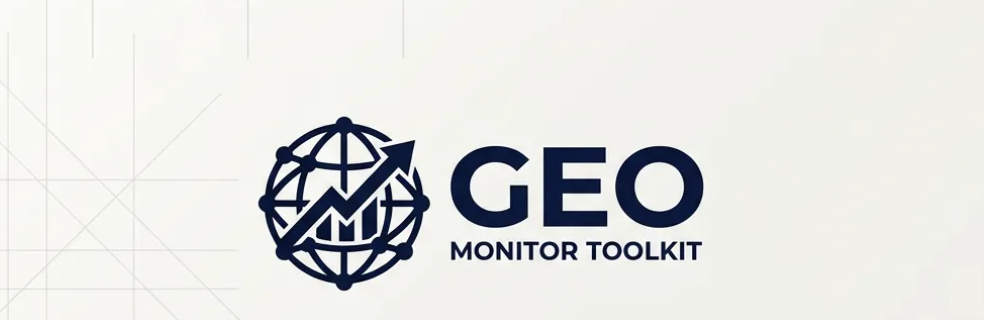
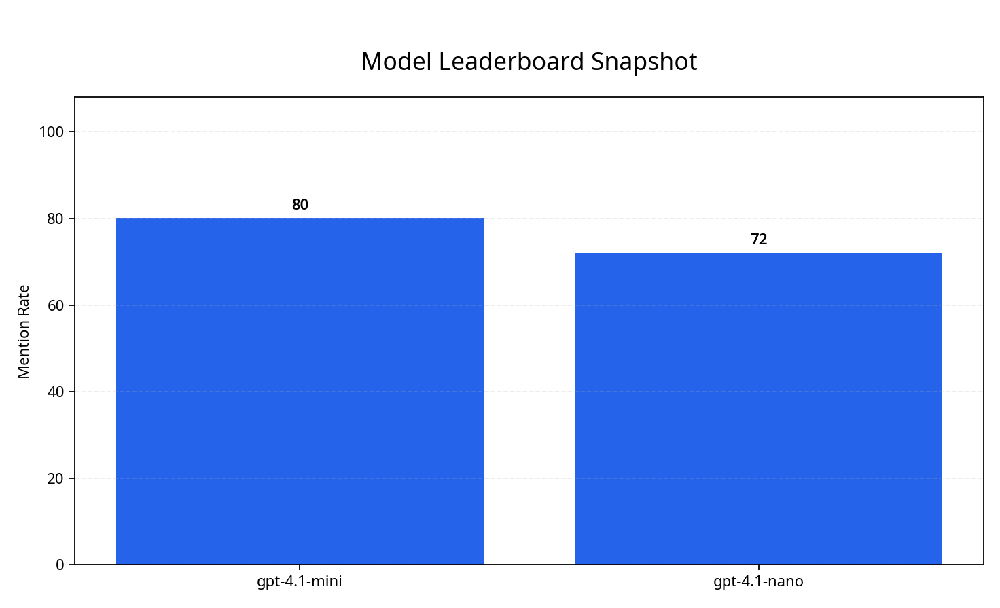
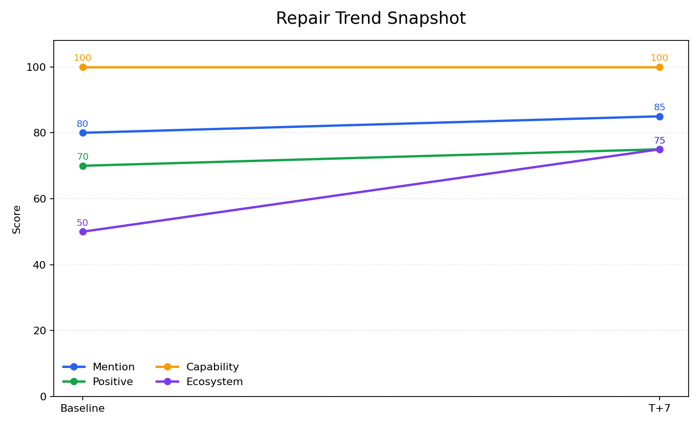

# GEO Monitor Toolkit



[](https://github.com/veeicwgy/geo-monitor-toolkit/actions/workflows/ci.yml)


> **GEO Monitoring OS for Developer Tools**

**GEO Monitor Toolkit** 是一套面向 **开发者工具、API、SDK 与开源项目** 的 GEO 监控与修复中台。它不是泛化的内容生成器，而是把 **Query Pool、LLM answer monitoring、四指标打分、repair loop、T+7/T+14 回归验证** 组织成一条可复现、可协作、可交付的工作流。

## Why This Repository Exists

与偏“内容生产”或“提示词集合”的仓库不同，这个项目优先解决的是 **模型是否提到你、提到得是否正确、能力是否被准确理解、生态关系是否被误判，以及修复动作是否真的改善结果**。

| Differentiator | What you get |
|---|---|
| Reproducible evaluation | `schema`、`rubric`、`run artifacts`、`summary`、`weekly report` |
| Repair loop | 不止给建议，还能记录 `repair action → T+7/T+14 delta` |
| Product focus | 聚焦 developer tools / API / SDK / open-source，而不是泛品牌营销 |
| Team workflow | 支持产品、DevRel、内容、增长与工程协同复盘 |

## Start in 30 Seconds

如果你第一次访问这个仓库，只跑下面四行：

```bash
git clone https://github.com/veeicwgy/geo-monitor-toolkit.git
cd geo-monitor-toolkit
bash install.sh
bash quickstart.sh
```

这条路径会同时完成 **依赖安装、数据校验、多模型手工演示、默认报告重放与图表生成**。

| Step | Command | Result |
|---|---|---|
| Install | `bash install.sh` | 创建本地环境并安装依赖 |
| Quickstart | `bash quickstart.sh` | 生成多模型 demo run 与默认报告快照 |
| Make alternative | `make quickstart` | 适合习惯 Make 的团队 |

## What You See on First Run

首次体验结束后，你应该立刻看到以下产物。

| Output | Path |
|---|---|
| Raw responses | `data/runs/quickstart-run/raw_responses.jsonl` |
| Score draft | `data/runs/quickstart-run/score_draft.jsonl` |
| Run manifest | `data/runs/quickstart-run/run_manifest.json` |
| Weekly report | `data/runs/sample-run/weekly_report.md` |
| Leaderboard snapshot | `assets/leaderboard-sample.png` |
| Repair trend snapshot | `assets/repair-trend-sample.png` |

默认首屏图现在直接展示 **多模型 leaderboard 快照**，避免首次访客只能看到单模型示意图。





## Who Should Use This

| Team / role | Use this when |
|---|---|
| Developer tools PMM / DevRel | 你要知道模型如何介绍安装方式、核心能力与生态集成 |
| Open-source maintainers | 你要修复错误答案、过时答案与竞品插入 |
| API / SDK teams | 你要建立稳定 Query Pool 并做周期性回跑 |
| Product + growth teams | 你需要一套能证明修复动作是否有效的 GEO 工作流 |

如果你现在需要的是 **通用 SEO 文案生成器** 或 **一次性的营销内容写手**，这个仓库并不是最佳入口。

## What You Can Prove in One Week

| Time window | What you can show |
|---|---|
| Day 1 | 建立 Query Pool 与模型范围 |
| Day 2-3 | 拿到 baseline 回答、四指标评分与周报 |
| Day 4-5 | 形成内容铺设与问题修复 backlog |
| Day 7 / Day 14 | 用相同 query 回跑并展示指标变化 |

## Runtime Modes

| Mode | Inputs | Outputs | Best for |
|---|---|---|---|
| Quickstart replay | `data/models.multi.sample.json` + `data/manual.multi.sample.json` | `quickstart-run` + 默认报告快照 | 首次体验、零 API 成本演示 |
| Manual paste mode | Query Pool + manual response JSON | `raw_responses.jsonl` + `score_draft.jsonl` | 把外部聊天结果导入仓库 |
| API collection mode | Query Pool + model config + API key | `raw_responses.jsonl` + `score_draft.jsonl` + 后续汇总 | 做真实批量 GEO 监控 |
| Multi-provider API collection | Query Pool + OpenAI-compatible gateway + enabled models | `raw_responses.jsonl` + 后续 summary/report | 跨 Claude / Gemini / DeepSeek / Qwen / MiniMax / GLM 等模型采集 |

## Multi-Provider API Collection

`run_chat_completions.py` 使用通用的 Chat Completions 接口，兼容 OpenAI-compatible 网关，可以同时采集多个 AI 厂商的回答。

```bash
export OPENAI_API_KEY=<your-key>
export OPENAI_BASE_URL=<your-gateway-url>

python scripts/run_chat_completions.py \
    --query-pool data/query-pools/mineru-example.json \
    --model-config data/models.sample.json \
    --out-dir data/runs/multi-provider-run

python -m geo_monitor report \
    --input data/runs/multi-provider-run/raw_responses.jsonl \
    --output-dir data/runs/multi-provider-run
```

在 `data/models.sample.json` 中将需要的模型 `enabled` 设为 `true`，即可按同一流程采集多 provider 回答。

| 模型 | api_model 字段 | 说明 |
|---|---|---|
| GPT-4o | `gpt-4o` | OpenAI 原生 |
| Claude Sonnet | `claude-sonnet-4-6` | 需通过兼容网关 |
| Gemini 2.5 Flash | `gemini-2.5-flash` | 需通过兼容网关 |
| DeepSeek V3 | `deepseek-v3-250324` | 需通过兼容网关 |
| Qwen Max | `qwen-max` | 需通过兼容网关 |
| MiniMax M2 | `minimax/minimax-m2` | 需通过兼容网关 |
| GLM-5 | `glm-5` | 需通过兼容网关 |

## Minimal Files You Can Start From

| File | Purpose |
|---|---|
| [`data/query-pools/mineru-example.json`](data/query-pools/mineru-example.json) | 默认开发者工具 Query Pool |
| [`data/models.sample.json`](data/models.sample.json) | 最小单模型配置 |
| [`data/models.multi.sample.json`](data/models.multi.sample.json) | 默认多模型演示配置 |
| [`data/manual.sample.json`](data/manual.sample.json) | 最小手工回答样例 |
| [`data/manual.multi.sample.json`](data/manual.multi.sample.json) | 多模型手工回答样例 |
| [`docs/metric-definition.md`](docs/metric-definition.md) | 四指标口径说明 |

## Trust Signals

仓库的核心信任信号应该放在首屏前 1/3，因此这里直接公开：

| Signal | Location |
|---|---|
| Real CI workflow | [`.github/workflows/ci.yml`](.github/workflows/ci.yml) |
| Leaderboard snapshot | [`assets/leaderboard-sample.png`](assets/leaderboard-sample.png) |
| Repair delta snapshot | [`assets/repair-trend-sample.png`](assets/repair-trend-sample.png) |
| Benchmark method | [`benchmark/README.md`](benchmark/README.md) |
| Case example | [`examples/mineru-case-study.md`](examples/mineru-case-study.md) |

## Read the Full Docs

README 保持为短版 landing。更详细的说明请直接进入长版文档。

| Topic | Path |
|---|---|
| Full getting started guide | [`docs/getting-started.md`](docs/getting-started.md) |
| Metric definition | [`docs/metric-definition.md`](docs/metric-definition.md) |
| Benchmark method | [`benchmark/README.md`](benchmark/README.md) |
| Reader guide | [`notebooks/README.md`](notebooks/README.md) |
| Repair template | [`templates/repair-validation.md`](templates/repair-validation.md) |
| Weekly report template | [`templates/weekly-report.md`](templates/weekly-report.md) |
| Release notes | [`release-notes/v0.2.0.md`](release-notes/v0.2.0.md) |

## Repository Map

| Directory | What it contains |
|---|---|
| `data/` | Query pools, sample configs, run outputs, repair validations |
| `schemas/` | Structured validation contracts |
| `rubrics/` | Scoring rules and annotation protocol |
| `scripts/` | Run, score, report, leaderboard, validation scripts |
| `playbooks/` | GEO strategy, monitoring, datasource mapping, repair SOP |
| `examples/` | Business or product case examples |

## CLI

如果你已经完成首次体验，可以直接使用统一 CLI：

```bash
python -m geo_monitor run --query-pool data/query-pools/mineru-example.json --model-config data/models.multi.sample.json --out-dir data/runs/demo-run --manual-responses data/manual.multi.sample.json
python -m geo_monitor report --input data/runs/sample-run/annotations.jsonl --output-dir data/runs/sample-run
python -m geo_monitor leaderboard
python -m geo_monitor validate
```

## Positioning

> **GEO Monitor Toolkit = GEO Monitoring OS for Developer Tools**
>
> 它关注的是 **监控、打分、修复与回归验证**，不是泛化营销内容生成器。
